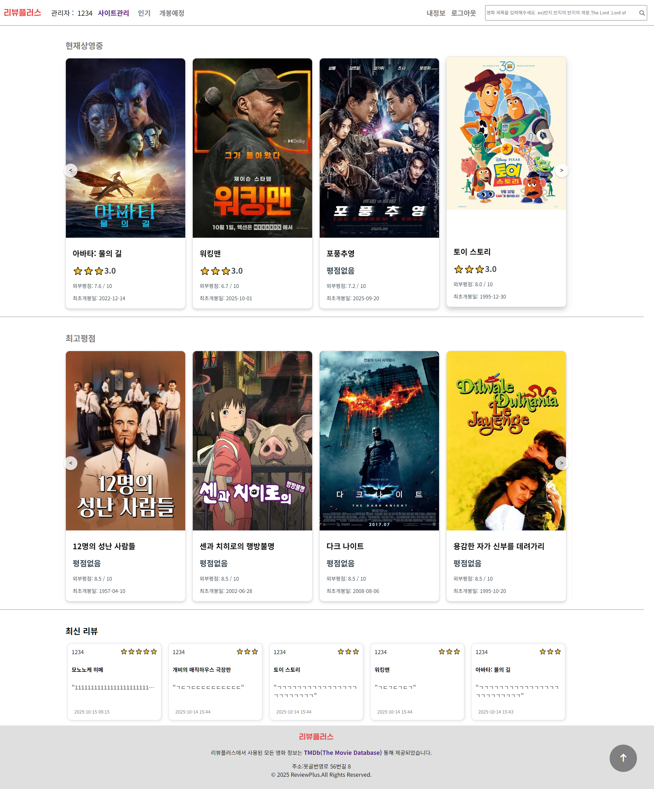
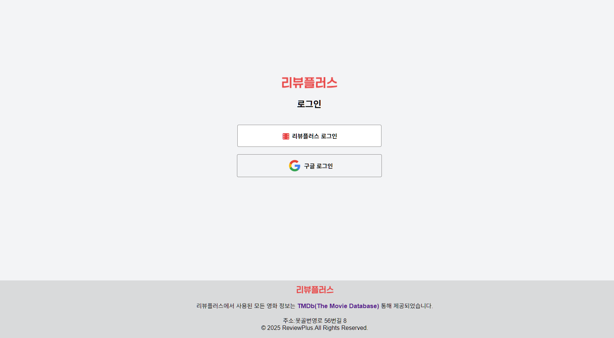
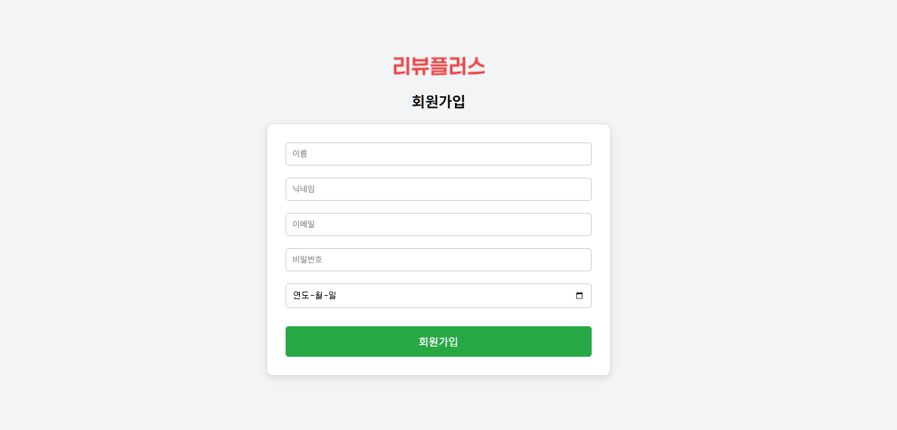
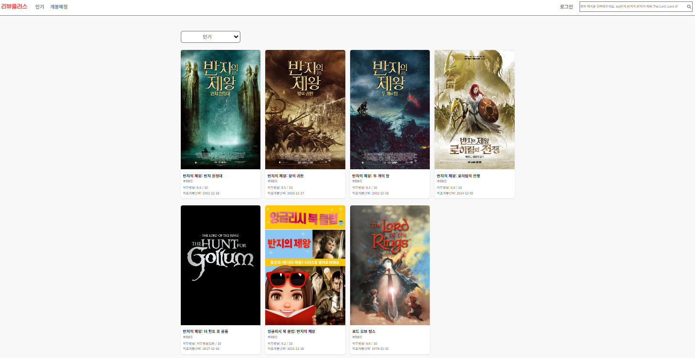
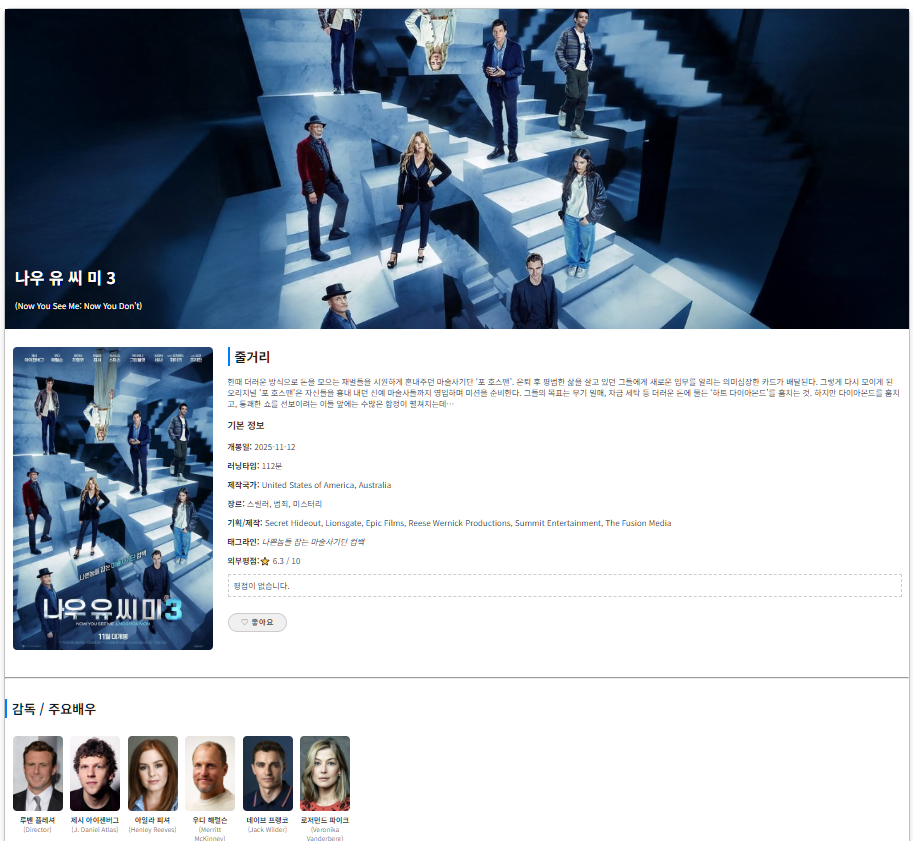
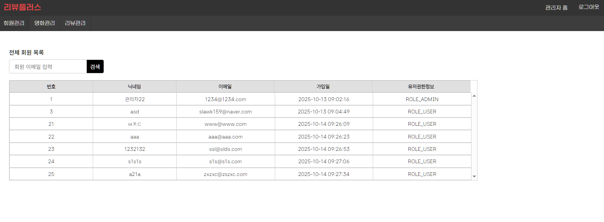
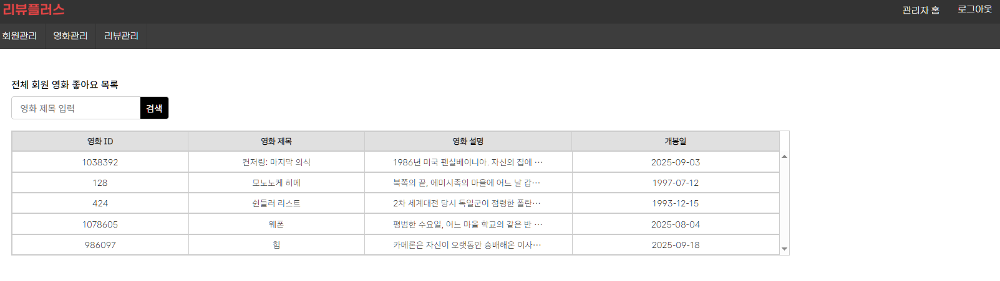
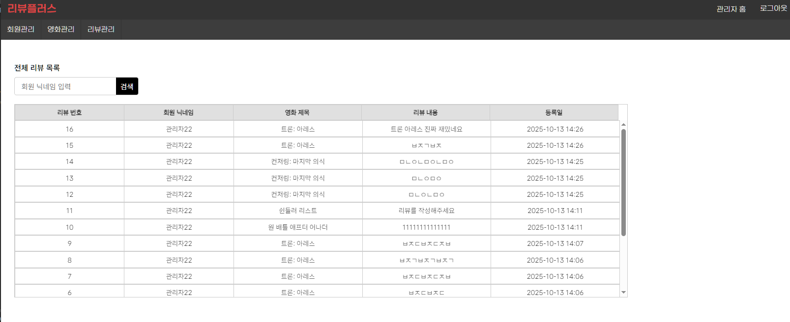

## 🎬 리뷰플러스

스프링 부트(JPA, Gradle) 기반 영화 리뷰 서비스

## 📚 프로젝트 소개
- **📆 프로젝트 기간 : 2025.09.26 ~ 2025.10.15**
- **팀 구성**: 조홍규(팀장), 김태경, 김근수, 강기민, 전재율, 권영승
- **팀 역할**:
  - 조홍규(팀장): 프로젝트 총괄, 외부 REST API로 영화 정보 가져오기, 팀원 작업 보조, 영화 검색 기능 구현, DB 처리
  - 김태경: 관리자 페이지 UI/UX, 관리자 회원 관리 기능 구현
  - 권영승: 홈 화면 UI/UX, 관리자 영화 관리 기능 구현
  - 전재율: 로그인/회원 가입 페이지 UI/UX, 로그인/회원 가입 기능 구현
  - 김근수: 회원 정보 조회 및 수정 기능 구현
  - 강기민: 영화 상세 페이지 UI/UX, 영화 좋아요, 리뷰 작성, 영화 상세 페이지 영화 정보 조회 기능 구현
- **핵심 기능**:
  - **REST API**를 활용한 **실시간 최신 영화 정보 검색** 기능
  - 사용자 - **리뷰**, **평점**, **좋아요** 기능
  - 관리자 - 전체 DB 데이터 CRUD 기능
- **노션**: [프로젝트 상세 보고서](https://www.notion.so/Project2-Team-CGV-3-27a5547a5bd581d98591f159c307fbe2)

## 🛠 기술 스택
### IDE
**Spring Tool Suite 4**

### 언어


### 프레임워크


### DB


### OS


### 협업 툴


---

## 💻 화면 구성
### 🎬 메인


### 🔑 로그인 / 회원가입
| 로그인 | 회원가입 |
|--------|-----------|
|  |  |

### 🎬 영화 검색 / 영화 상세
| 검색 | 상세 |
|------|------|
|  |  |

### 🛠 관리자 페이지
| 회원 관리 | 영화 관리 | 리뷰 관리
|------------|------------|------------|
|  |  | 

---

## 디렉토리 구조
```bash
📦src
 ┣ 📂main
 ┃ ┣ 📂java
 ┃ ┃ ┗ 📂com
 ┃ ┃ ┃ ┗ 📂review
 ┃ ┃ ┃ ┃ ┣ 📂config
 ┃ ┃ ┃ ┃ ┃ ┣ 📜CustomSuccessHandler.java
 ┃ ┃ ┃ ┃ ┃ ┣ 📜CustomUserDetails.java
 ┃ ┃ ┃ ┃ ┃ ┗ 📜SecurityConfig.java
 ┃ ┃ ┃ ┃ ┣ 📂controller
 ┃ ┃ ┃ ┃ ┃ ┣ 📜AdminController.java
 ┃ ┃ ┃ ┃ ┃ ┣ 📜MovieApiController.java
 ┃ ┃ ┃ ┃ ┃ ┣ 📜MovieController.java
 ┃ ┃ ┃ ┃ ┃ ┣ 📜UserApiController.java
 ┃ ┃ ┃ ┃ ┃ ┣ 📜UserController.java
 ┃ ┃ ┃ ┃ ┃ ┗ 📜UserReviewApiController.java
 ┃ ┃ ┃ ┃ ┣ 📂DTO
 ┃ ┃ ┃ ┃ ┃ ┣ 📜movieDTO.java
 ┃ ┃ ┃ ┃ ┃ ┣ 📜movieLikeDTO.java
 ┃ ┃ ┃ ┃ ┃ ┣ 📜OAuth2Attributes.java
 ┃ ┃ ┃ ┃ ┃ ┣ 📜SearchResponseDTO.java
 ┃ ┃ ┃ ┃ ┃ ┣ 📜TmdbResponseDTO.java
 ┃ ┃ ┃ ┃ ┃ ┣ 📜UserDTO.java
 ┃ ┃ ┃ ┃ ┃ ┣ 📜UserEditDTO.java
 ┃ ┃ ┃ ┃ ┃ ┗ 📜UserReviewDTO.java
 ┃ ┃ ┃ ┃ ┣ 📂entity
 ┃ ┃ ┃ ┃ ┃ ┣ 📜movieEntity.java
 ┃ ┃ ┃ ┃ ┃ ┣ 📜MovieLike.java
 ┃ ┃ ┃ ┃ ┃ ┣ 📜MovieLikeId.java
 ┃ ┃ ┃ ┃ ┃ ┣ 📜ReviewLike.java
 ┃ ┃ ┃ ┃ ┃ ┣ 📜ReviewLikeId.java
 ┃ ┃ ┃ ┃ ┃ ┣ 📜userEntity.java
 ┃ ┃ ┃ ┃ ┃ ┗ 📜userReviewEntity.java
 ┃ ┃ ┃ ┃ ┣ 📂Enum
 ┃ ┃ ┃ ┃ ┃ ┗ 📜SocialType.java
 ┃ ┃ ┃ ┃ ┣ 📂repository
 ┃ ┃ ┃ ┃ ┃ ┣ 📜MovieLikeRepository.java
 ┃ ┃ ┃ ┃ ┃ ┣ 📜MovieRepository.java
 ┃ ┃ ┃ ┃ ┃ ┣ 📜UserRepository.java
 ┃ ┃ ┃ ┃ ┃ ┗ 📜UserReviewRepository.java
 ┃ ┃ ┃ ┃ ┣ 📂service
 ┃ ┃ ┃ ┃ ┃ ┣ 📜CustomOAuth2UserService.java
 ┃ ┃ ┃ ┃ ┃ ┣ 📜InquiryService.java
 ┃ ┃ ┃ ┃ ┃ ┣ 📜MovieLikeService.java
 ┃ ┃ ┃ ┃ ┃ ┣ 📜MovieService.java
 ┃ ┃ ┃ ┃ ┃ ┣ 📜TmdbApiService.java
 ┃ ┃ ┃ ┃ ┃ ┣ 📜UserReviewService.java
 ┃ ┃ ┃ ┃ ┃ ┗ 📜UserService.java
 ┃ ┃ ┃ ┃ ┗ 📜ReviewPlusApplication.java
 ┃ ┣ 📂resources
 ┃ ┃ ┣ 📂static
 ┃ ┃ ┃ ┣ 📂css
 ┃ ┃ ┃ ┃ ┣ 📜admin.css
 ┃ ┃ ┃ ┃ ┣ 📜common.css
 ┃ ┃ ┃ ┃ ┣ 📜footer.css
 ┃ ┃ ┃ ┃ ┣ 📜header.css
 ┃ ┃ ┃ ┃ ┣ 📜index.css
 ┃ ┃ ┃ ┃ ┣ 📜movies_detail.css
 ┃ ┃ ┃ ┃ ┣ 📜movies_list.css
 ┃ ┃ ┃ ┃ ┣ 📜now_playing.css
 ┃ ┃ ┃ ┃ ┣ 📜scroll-to-top.css
 ┃ ┃ ┃ ┃ ┣ 📜table-scroll.css
 ┃ ┃ ┃ ┃ ┣ 📜top_rate.css
 ┃ ┃ ┃ ┃ ┣ 📜user_edit.css
 ┃ ┃ ┃ ┃ ┣ 📜user_login.css
 ┃ ┃ ┃ ┃ ┣ 📜user_mypage.css
 ┃ ┃ ┃ ┃ ┗ 📜user_newjoin.css
 ┃ ┃ ┃ ┣ 📂images
 ┃ ┃ ┃ ┃ ┗ 📜logo.png
 ┃ ┃ ┃ ┗ 📂js
 ┃ ┃ ┃ ┃ ┣ 📜movies_detail.js
 ┃ ┃ ┃ ┃ ┣ 📜movies_list.js
 ┃ ┃ ┃ ┃ ┣ 📜movies_review.js
 ┃ ┃ ┃ ┃ ┣ 📜movie_LikeBtn.js
 ┃ ┃ ┃ ┃ ┣ 📜movie_search.js
 ┃ ┃ ┃ ┃ ┣ 📜now_playing.js
 ┃ ┃ ┃ ┃ ┣ 📜scroll-to-top.js
 ┃ ┃ ┃ ┃ ┣ 📜top_rate.js
 ┃ ┃ ┃ ┃ ┣ 📜user_LikeListBtn.js
 ┃ ┃ ┃ ┃ ┣ 📜user_login.js
 ┃ ┃ ┃ ┃ ┣ 📜user_newjoin.js
 ┃ ┃ ┃ ┃ ┗ 📜user_ReviewListBtn.js
 ┃ ┃ ┣ 📂templates
 ┃ ┃ ┃ ┣ 📂admin
 ┃ ┃ ┃ ┃ ┣ 📜access-error.html
 ┃ ┃ ┃ ┃ ┣ 📜admin.html
 ┃ ┃ ┃ ┃ ┣ 📜admin_movie.html
 ┃ ┃ ┃ ┃ ┣ 📜admin_movie_detail.html
 ┃ ┃ ┃ ┃ ┣ 📜admin_review.html
 ┃ ┃ ┃ ┃ ┣ 📜admin_review_detail.html
 ┃ ┃ ┃ ┃ ┣ 📜admin_user.html
 ┃ ┃ ┃ ┃ ┗ 📜admin_user_detail.html
 ┃ ┃ ┃ ┣ 📂index
 ┃ ┃ ┃ ┃ ┣ 📜index.html
 ┃ ┃ ┃ ┃ ┣ 📜now_playing.html
 ┃ ┃ ┃ ┃ ┗ 📜top_rate.html
 ┃ ┃ ┃ ┣ 📂movies
 ┃ ┃ ┃ ┃ ┣ 📜movies_detail.html
 ┃ ┃ ┃ ┃ ┗ 📜movies_list.html
 ┃ ┃ ┃ ┗ 📂user
 ┃ ┃ ┃ ┃ ┣ 📜user_dormant.html
 ┃ ┃ ┃ ┃ ┣ 📜user_edit.html
 ┃ ┃ ┃ ┃ ┣ 📜user_login.html
 ┃ ┃ ┃ ┃ ┣ 📜user_loginMain.html
 ┃ ┃ ┃ ┃ ┣ 📜user_mypage.html
 ┃ ┃ ┃ ┃ ┣ 📜user_newjoin.html
 ┃ ┃ ┃ ┃ ┗ 📜user_socialEdit.html
 ┃ ┃ ┣ 📜application.properties
 ┃ ┃ ┣ 📜application.yml
 ┃ ┃ ┗ 📜schema-oracle.sql
 ┃ ┗ 📂webapp
 ┃ ┃ ┣ 📂META-INF
 ┃ ┃ ┃ ┗ 📜MANIFEST.MF
 ┃ ┃ ┗ 📂WEB-INF
 ┃ ┃ ┃ ┗ 📂lib
 ┗ 📂test
 ┃ ┗ 📂java
 ┃ ┃ ┗ 📂com
 ┃ ┃ ┃ ┗ 📂review
 ┃ ┃ ┃ ┃ ┗ 📜ReviewPlusApplicationTests.java

```
